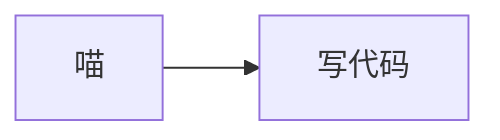

# Qwara's Corner 🐾

A personal portfolio & blog built with Astro 7, wearing a **QWARA RESEARCH ARCHIVE** design language — NASA-Punk 档案纸 with VHS cassette-futurism textures, NASA safety-orange accents, Swiss-grid type, a fullscreen playback hero, and a hidden cat easter egg.


## ✨ Features

### Core
- **Astro 7 + Content Layer API** — Modern content collections with Zod 4 validation
- **Tailwind CSS v4** — CSS-first configuration, Oxide engine, `@theme` tokens
- **Bilingual (中文 / English)** — `astro:i18n` routing with `/en/` prefix
- **Markdown + MDX** — Blog posts with syntax highlighting & reading time
- **KaTeX math** — `$...$` / `$$...$$` formulas via `remark-math` + `rehype-katex`
- **Mermaid diagrams** — ```mermaid fenced blocks, lazily rendered on scroll (theme-aware)
- **RSS Feed & Sitemap** — Auto-generated `/rss.xml` + `/en/rss.xml` and `/sitemap-index.xml`
- **`/now` page** — Indie-web style "what I'm up to" page, content-driven per locale

### Design
- **Golden Ratio (φ ≈ 1.618)** — Typography scale, section spacing, grid proportions, aspect ratios
- **NASA-Punk 档案纸 palette** — Cream archival paper (`#f6f1e5`) with NASA safety-orange (`#e85d2a`) accent, VHS red/yellow/cyan bars, blueprint grid & halftone textures, square corners
- **View Transitions** — Smooth page transitions via `<ClientRouter />`
- **Light default + 胶片负片 dark mode** — Persisted in localStorage, re-applied across navigations
- **Mobile-first** — Responsive layout with full-screen mobile menu

### Motion (nonlinear only, no bounce)
- **Fullscreen playback hero** — Name decode, REC/timecode, periodic RGB glitch, interactive transport deck
- **CSS transitions + IntersectionObserver** — Scroll-reveal animations, skill bar fills, stagger grids
- **reduced-motion** — Respects `prefers-reduced-motion` media query

## 🛠 Tech Stack

| Category | Tech |
|---|---|
| Framework | [Astro 7.1.6](https://astro.build) |
| Styling | [Tailwind CSS 4.3.3](https://tailwindcss.com) + `@tailwindcss/vite` |
| Math | [KaTeX](https://katex.org) via `remark-math` + `rehype-katex` |
| Diagrams | [Mermaid](https://mermaid.js.org) — lazy-loaded client-side render |
| Content | Astro Content Layer API + MDX |
| Search | Client-side filtering (zero-dependency) |
| Deployment | GitHub Pages |

## 📁 Project Structure

```
├── astro.config.mjs          # Astro config + i18n + integrations
├── public/                   # Static assets (favicon, OG image, avatar)
├── scripts/
│   └── fetch-github-repos.mjs  # Build-time GitHub repos fetch
├── src/
│   ├── components/
│   │   ├── animations/       # ScrollFX (scroll engine), StaggerGrid
│   │   ├── Navbar.astro      # Fixed nav with theme/lang toggle
│   │   ├── Footer.astro      # Social links + colophon
│   │   ├── Hero.astro        # Homepage hero entrance
│   │   ├── About.astro       # About section with avatar
│   │   ├── Skills.astro      # Skill bars (scroll-triggered)
│   │   ├── Timeline.astro    # Learning journey
│   │   ├── BlogCard.astro   # Blog post card
│   │   ├── ProjectCard.astro # GitHub project card
│   │   ├── Mermaid.astro    # Lazy Mermaid renderer (post pages)
│   │   └── MeowEasterEgg.astro
│   ├── content.config.ts     # Content Layer collections
│   ├── data/
│   │   ├── blog/zh/          # Chinese MDX blog posts
│   │   ├── blog/en/          # English MDX blog posts
│   │   ├── now/              # /now page content (zh.mdx / en.mdx)
│   │   └── projects/         # GitHub repos (auto-fetched)
│   ├── i18n/
│   │   ├── ui.ts             # Bilingual UI strings
│   │   └── utils.ts          # Translation helpers
│   ├── layouts/
│   │   ├── BaseLayout.astro  # HTML shell + meta + View Transitions
│   │   └── PostLayout.astro  # Blog post with TOC + reading progress
│   ├── pages/                # Routes (index, blog, projects, tags, search, now, 404)
│   ├── styles/
│   │   └── global.css        # Tailwind v4 import + theme + components
│   └── utils/
│       └── posts.ts          # Content query helpers
└── .github/workflows/
    └── deploy.yml            # GitHub Actions → Pages
```

## 🚀 Getting Started

### Prerequisites
- Node.js ≥ 22.12.0

### Development
```bash
npm install
npm run dev
```
Visit `http://localhost:4321/`

### Build
```bash
npm run build
npm run preview
```

### Key Scripts
| Command | Description |
|---|---|
| `npm run dev` | Start dev server (fetches GitHub repos first) |
| `npm run build` | Build the site |
| `npm run preview` | Preview production build |
| `npm run check` | Astro type check |
| `npm run fetch:github` | Manually refresh GitHub repos |

## 🎨 Customization

### Adding Blog Posts
Create `.md` or `.mdx` in `src/data/blog/zh/` or `src/data/blog/en/`:

```yaml
---
title: "My Post"
description: "A short description"
pubDate: 2026-07-31
tags: ["astro", "tutorial"]
lang: "zh"
---
```

### Math & Diagrams
- **KaTeX**: `$e^{i\pi}+1=0$` inline, `$$\int_0^1 x\,dx$$` block — works in `.md` and `.mdx`
- **Mermaid**: write a fenced block with the `mermaid` language tag; the diagram renders lazily on scroll and follows the site theme:

````

````

### Updating the /now Page
Edit `src/data/now/zh.mdx` / `src/data/now/en.mdx` — frontmatter `updatedDate` shows the "updated" chip.

### GitHub Projects
Projects auto-sync from your GitHub at build time. No manual editing needed.

### Theme Colors
Semantic colors are CSS custom properties in `src/styles/global.css` (`:root` light default / `.dark` film negative), so both themes stay in sync — reference the vars, not hard-coded hexes:

```css
@theme {
  --color-paper-100: #f6f1e5;     /* archival paper scale */
  --color-signal-orange: #e85d2a; /* NASA safety orange accent */
  --color-signal-red: #d0342c;    /* VHS tri-colour bars */
  --color-signal-yellow: #e9b41e;
  --color-signal-cyan: #0e8f9c;
}

:root {
  --bg: #f6f1e5;                  /* light = archival paper */
  --accent: #e85d2a;
  --on-accent: #faf6ec;           /* text on accent surfaces */
}
.dark {                            /* 胶片负片 */
  --bg: #141210;
  --accent: #f0833d;
  --on-accent: #141210;
}
```

Rule of thumb: text on an accent **surface** uses `var(--on-accent)` (not a hard-coded hex).

### Golden Ratio Tokens
```css
--phi: 1.618;
--spacing-phi-1: 1.618rem;
--spacing-phi-2: 2.618rem;
--spacing-phi-3: 4.236rem;
--ratio-phi: 1.618 / 1;
```

## 📄 License

MIT

---

<div align="center">

built with 🐾 and vibe coding

</div>
